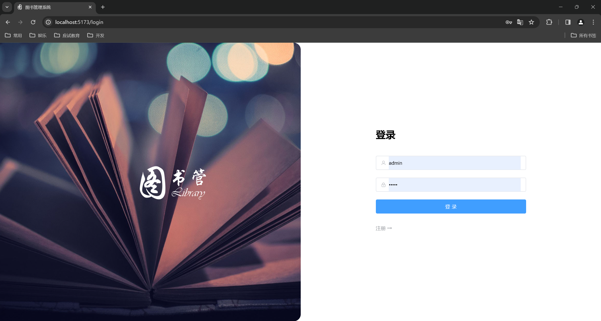
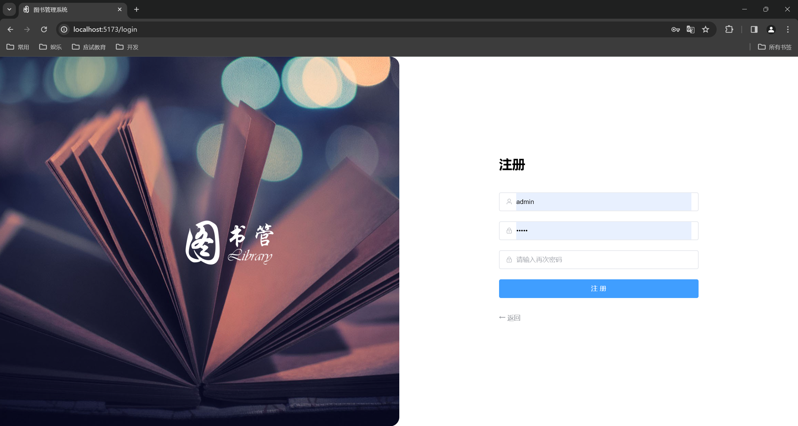
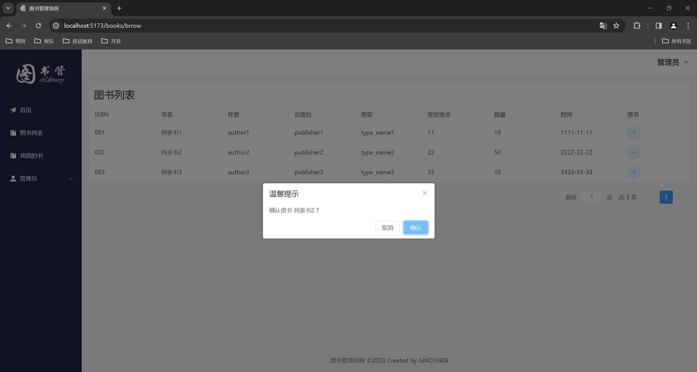
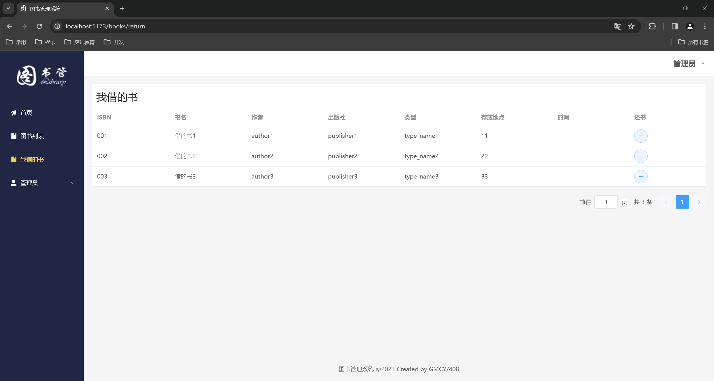
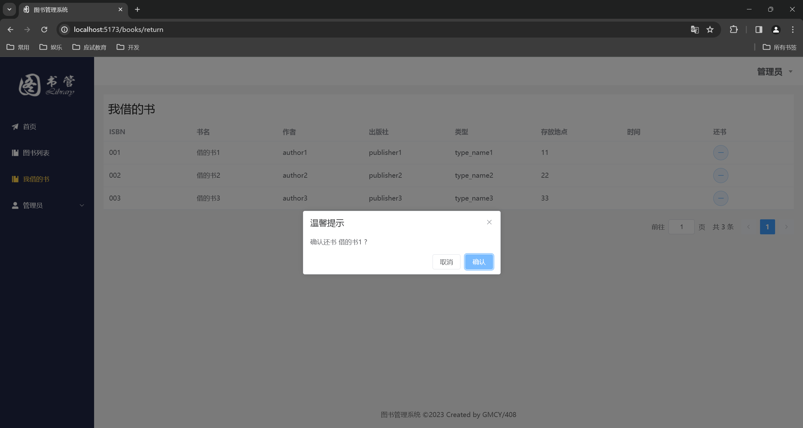
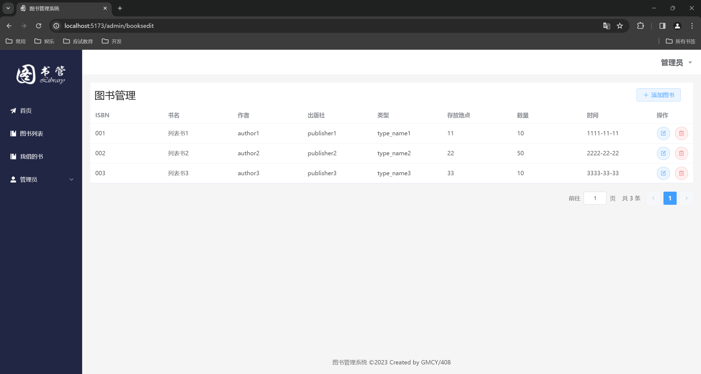
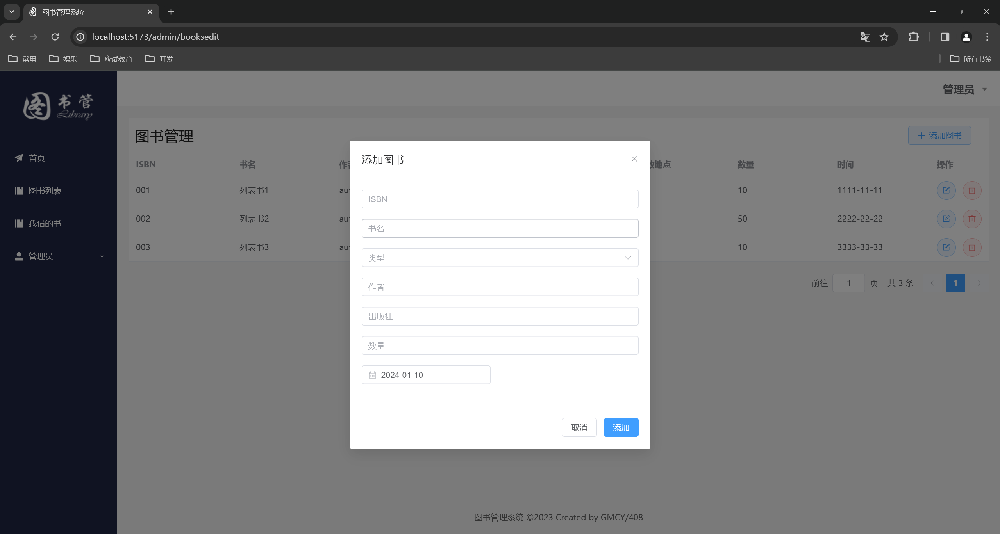
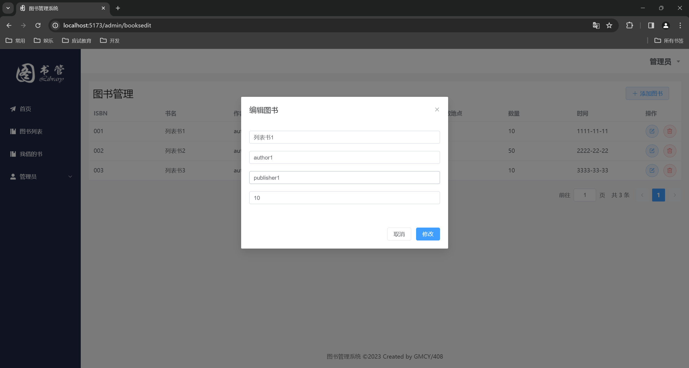
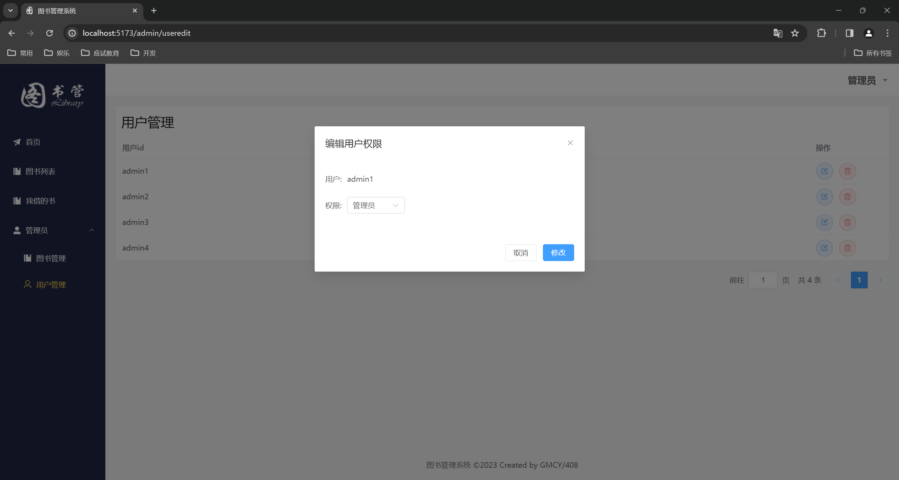
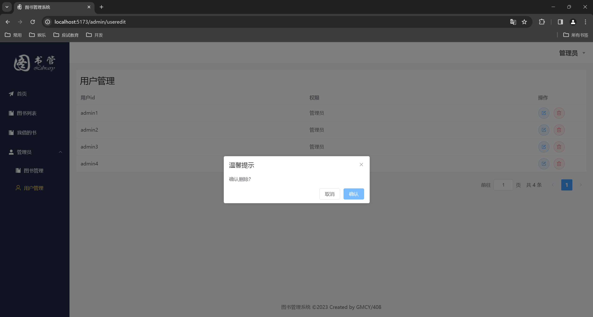

# 图书管理系统

## 1. 基本信息

- 作者: GMCY
- 系列: 大学课程作业
- 仓库: [GitHub](https://github.com/GMCY2020/University-LibrarySystem) | [Gitee](https://gitee.com/GMCY2020/University-LibrarySystem)
- 话题(GitHub): [vue](https://github.com/topics/vue) \ [university-coursework](https://github.com/topics/university-coursework) \ [vue3](https://github.com/topics/vue3)
- 创建时间: 2023/12/11

## 2. 介绍

背景

- 实训周项目作业: 小组完成一个项目

- 前后分离开发, 该部分项目是前端项目

前端

- 前端框架: `Vue3`

- 前端项目: [gitee](https://gitee.com/GMCY2020/dorm408-LibrarySystem-Vue) \ [github](https://github.com/GMCY2020/dorm408-LibrarySystem-Vue)

后端

- 后端框架: `SpringBoot`

- 后端项目: [gitee](https://gitee.com/turing-ice/dorm408-LibrarySystem
) \ [github](https://github.com/Turing158/dorm408-LibrarySystem)

说明

- 编写时间仓促，冗杂代码比较多/_ \

## 3. 环境

编辑器
- `VSCode`

依赖
- `node.js` >= 18.16.0
- `npm`
- `pnpm`

框架
- `vue3`

模式
- 默认 `调试` , 无需后端
- 建议 关闭 `调试` , 与后端连用

  修改 `src\stores\modules\deBug.js`
  ```js
  const isStartDebug = ref(false)
  ```
## 4. 使用

下载依赖
```sh
pnpm install
```
启动
```sh
pnpm dev
```

## 5. 效果图

首页


登录注册



图书列表



我借的书



图书管理





用户管理



